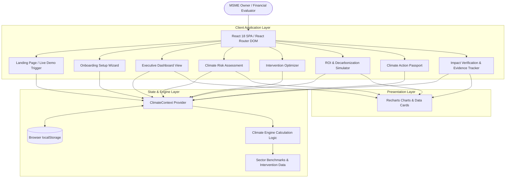

# ClimaX — AI-Powered Climate Intelligence for MSMEs

An AI-powered decision platform that helps Micro, Small, and Medium Enterprises (MSMEs) identify physical and transition climate risks, optimize sustainability investments within capital budgets, generate bank-ready project dossiers ("Climate Action Passports"), and verify real-world environmental and financial impact.

---

## Table of Contents
- [Overview](#overview)
- [Key Features](#key-features)
- [Tech Stack](#tech-stack)
- [System Architecture](#system-architecture)
- [Project Structure](#project-structure)
- [Prerequisites](#prerequisites)
- [Installation](#installation)
- [Environment Variables](#environment-variables)
- [Running the Application](#running-the-application)
- [Application Workflow](#application-workflow)
- [Testing](#testing)
- [Build & Production](#build--production)
- [Security](#security)
- [Troubleshooting](#troubleshooting)
- [Future Improvements](#future-improvements)
- [Contributing](#contributing)
- [License](#license)
- [Author](#author)

---

## Overview

### The Problem
Micro, Small, and Medium Enterprises (MSMEs) face growing climate risks, including extreme heat waves, localized flooding, monsoon disruptions, rising grid electricity tariffs, and tightening carbon compliance standards (such as the EU's Carbon Border Adjustment Mechanism — CBAM). However, most MSMEs encounter significant hurdles:
- **Limited Capital**: Restricted budgets requiring fast investment payback.
- **Lack of Technical Expertise**: High cost and complexity of hiring ESG consultants.
- **Rising Operational Costs**: Increasing resource expenses directly impacting profit margins.
- **Financing Barriers**: Difficulty presenting structured, bank-ready sustainability project documentation to secure green loans.

### The Solution
**ClimaX** bridges the gap between climate risk assessment and practical business action. It provides an intuitive, budget-aware decision engine that translates complex operational and geographic data into clear financial payback curves, prioritized equipment intervention pathways, and verified digital project passports ready for lenders and OEM supply chain compliance.

---

## Key Features

### Currently Implemented Features

- **Interactive Landing & Instant Live Demo**
  - Communicate the core value proposition within seconds.
  - One-click **Launch Live Demo** preloaded with realistic MSME data (*Shakti Precision Components*) for immediate evaluation without setup.

- **MSME Onboarding & Risk Profiling**
  - Multi-step guided setup wizard collecting business sector, location, employee count, monthly utility expenses (electricity, water, fuel), operational hours, climate hazard concerns, budget limits, and target payback expectations.

- **Executive Dashboard**
  - High-level overview of overall climate risk tier, annual carbon footprint baseline, projected CO₂ abatement, estimated annual financial savings, resource cost distribution, and direct action triggers.

- **Climate Risk & Vulnerability Analysis**
  - **Physical Risks**: Location-aware scoring for extreme heat, flooding, monsoon disruption, and water scarcity.
  - **Transition Risks**: Assessment of CBAM export tax liabilities, energy tariff inflation, and OEM supply chain compliance demands.

- **Green Technology Intervention Optimizer**
  - Filterable catalog of high-ROI equipment upgrades (e.g., Rooftop Solar, IE4 Ultra-Efficient Motors, Rainwater Harvesting & Recycling, Waste Heat Recovery, Industrial Waste Recycling).
  - Automatically filters recommendations matching the user's defined budget threshold.

- **ROI & Decarbonization Scenario Simulator**
  - Interactive financial modeling allowing users to adjust available budget and time horizons (3, 5, 10 years).
  - Computes Net Present Value (NPV), Internal Rate of Return (IRR), payback period in years, annual financial savings, and cumulative CO₂ abatement curves using Recharts visual graphs.

- **Climate Action Passport Generation**
  - Generates a structured digital project certificate featuring a unique Verification ID, verification badge status, risk classification, baseline vs. target emissions, selected interventions, financial metrics, and checksum verification.

- **Impact Verification & Evidence Tracking**
  - Upload utility bill evidence and track actual vs. predicted energy and carbon savings.
  - Verification log maintaining audit history for financial institution green-loan discounts.

- **State Management & Persistence**
  - Global `ClimateContext` state provider with automatic `localStorage` synchronization for seamless demo resets and custom profile retention.

---

## Tech Stack

| Layer | Technology | Version | Purpose |
|---|---|---|---|
| **Frontend Framework** | React | ^18.3.1 | UI Component Architecture |
| **Language** | TypeScript | ~5.7.2 | Type Safety & Interface Contracts |
| **Build Tool** | Vite | ^6.1.0 | Fast Development Server & Bundler |
| **Routing** | React Router DOM | ^6.28.2 | Client-Side SPA Navigation |
| **Styling** | TailwindCSS | ^4.0.6 | Utility-First Styling System |
| **Icons** | Lucide React | ^0.475.0 | Vector UI Icons |
| **Data Visualization** | Recharts | ^2.15.1 | Financial & Carbon Charts |
| **State Management** | React Context API | Native | Profile & Simulation Context |
| **Data Persistence** | Browser `localStorage` | Native | Client-Side Profile Cache |
| **Class Utilities** | `clsx` & `tailwind-merge` | ^2.1.1 / ^3.0.1 | Dynamic Utility Merging |

---

## System Architecture

ClimaX operates as a client-side Single Page Application (SPA). All risk algorithms, financial models, baseline carbon estimates, and scenario projections run directly in the browser via the client-side Climate Calculation Engine (`climateEngine.ts`).



---

## Project Structure

```text
ClimaX-AI-Powered-Climate-Intelligence-for-MSMEs/
├── index.html                  # Main HTML entry point with Google Fonts
├── package.json                # Dependencies, devDependencies, and npm scripts
├── package-lock.json           # Locked dependency tree
├── tsconfig.json               # Root TypeScript configuration
├── tsconfig.app.json           # Frontend application TypeScript options
├── tsconfig.node.json          # Node/Vite build TypeScript options
├── vite.config.ts              # Vite server & build configurations
├── .gitignore                  # Git ignored files and directories
├── Climate_Action_Passport...pdf # Comprehensive research & technical design doc
└── src/
    ├── main.tsx                # React DOM root render entry point
    ├── App.tsx                 # Route setup & provider wrapper
    ├── index.css               # Global Tailwind CSS imports & theme styles
    ├── components/             # UI and Layout Components
    │   ├── Header.tsx          # App header with location indicator & Reset Demo trigger
    │   ├── Sidebar.tsx         # Left navigation sidebar
    │   └── ui/                 # Reusable UI library
    │       ├── Badge.tsx       # Status & risk pill badges
    │       ├── Button.tsx      # Custom button components
    │       ├── Card.tsx        # Styled card containers
    │       ├── ChartCard.tsx   # Recharts container card
    │       ├── EmptyState.tsx  # Empty state component
    │       ├── Input.tsx       # Form input fields
    │       ├── LoadingState.tsx# Loading fallback
    │       ├── MetricCard.tsx  # Metric indicator card
    │       ├── Modal.tsx       # Dialog modal container
    │       ├── ProgressBar.tsx# Progress bar component
    │       ├── RiskBadge.tsx   # Risk level indicator badge
    │       ├── Select.tsx      # Select dropdown component
    │       ├── Slider.tsx      # Interactive range slider
    │       ├── StatusBadge.tsx # Status indicator badge
    │       ├── Stepper.tsx     # Multi-step progress indicator
    │       └── index.ts        # UI component barrel export
    ├── context/                # React Context Providers
    │   └── ClimateContext.tsx  # Global profile, simulation, & passport state
    ├── data/                   # System Datasets
    │   └── mockData.ts         # Sector baselines & intervention catalog
    ├── hooks/                  # Custom React Hooks
    │   └── usePassport.ts      # Passport access hook
    ├── layouts/                # Shell Layouts
    │   └── AppLayout.tsx       # Main dashboard layout wrapper
    ├── pages/                  # Page Components
    │   ├── LandingPage.tsx     # Hero overview & live demo launcher
    │   ├── OnboardingPage.tsx  # Multi-step profile setup wizard
    │   ├── DashboardPage.tsx   # Executive overview & key metrics
    │   ├── ClimateRiskPage.tsx # Physical & transition risk details
    │   ├── InterventionsPage.tsx# Budget-aware intervention optimizer
    │   ├── SimulatorPage.tsx   # ROI & decarbonization simulator
    │   ├── PassportPage.tsx    # Bank-ready digital passport certificate
    │   └── ImpactPage.tsx      # Utility bill evidence upload & verification
    ├── services/               # Data Services
    │   └── api.ts              # Async data fetch simulation
    ├── types/                  # TypeScript Data Models
    │   └── index.ts            # Interfaces for MSME Profile, Risks, Passport, etc.
    └── utils/                  # Core Utilities & Algorithms
        ├── climateEngine.ts    # Risk scoring, baseline emissions & ROI calculations
        └── helpers.ts          # Currency, weight, & date formatting helpers
```

---

## Prerequisites

Before running the project locally, ensure you have the following installed:

- **Node.js**: Version `18.0.0` or higher (Recommended: Node 20+)
- **npm**: Version `9.0.0` or higher

Check your installed versions by running:
```bash
node -v
npm -v
```

---

## Installation

1. **Clone the Repository**:
   ```bash
   git clone https://github.com/Prajwal-S-45/ClimaX-AI-Powered-Climate-Intelligence-for-MSMEs.git
   cd ClimaX-AI-Powered-Climate-Intelligence-for-MSMEs
   ```

2. **Install Dependencies**:
   ```bash
   npm install
   ```

---

## Environment Variables

Currently, the application runs entirely in client-side mode with built-in sector benchmarks and calculation algorithms. **No external environment variables or `.env` files are required** to run the application locally.

---

## Running the Application

### Development Server

Start the Vite development server:
```bash
npm run dev
```

By default, the application will run at:
`http://localhost:5173` (or the next available port).

---

## Application Workflow

```text
                                [ Landing Page ]
                                       │
            ┌──────────────────────────┴──────────────────────────┐
            ▼                                                     ▼
 [ Launch Live Demo Button ]                           [ Custom Onboarding ]
 (Preloads Shakti Precision Profile)                   (Captures MSME Profile Data)
            │                                                     │
            └──────────────────────────┬──────────────────────────┘
                                       ▼
                       [ Climate Calculation Engine ]
          (Calculates Baseline CO₂, Physical/Transition Risks, & ROI)
                                       │
                                       ▼
                             [ Executive Dashboard ]
                                       │
        ┌──────────────────┬───────────┴───────────┬──────────────────┐
        ▼                  ▼                       ▼                  ▼
[ Climate Risk ]   [ Interventions ]        [ ROI Simulator ]   [ Action Passport ]
(Hazard Mapping)   (Budget Filtering)      (Financial Charts)   (Bank-Ready Doc)
        │                  │                       │                  │
        └──────────────────┴───────────┬───────────┴──────────────────┘
                                       ▼
                            [ Impact Verification ]
                     (Upload Bills & Track Actual Savings)
```

---

## Testing

Currently, manual testing is performed directly via the Vite development environment. The project configuration does not currently include automated testing frameworks (e.g., Vitest or Jest).

To test TypeScript compilation integrity:
```bash
npx tsc --noEmit
```

---

## Build & Production

To create an optimized production build:

1. **Run the Build Command**:
   ```bash
   npm run build
   ```
   This command executes TypeScript compilation (`tsc -b`) followed by Vite production bundling (`vite build`). Output files will be generated in the `dist/` directory.

2. **Preview the Build**:
   ```bash
   npm run preview
   ```
   This starts a local static web server to test the production output.

---

## Security

- **Client-Side Storage**: Profile data is persisted in browser `localStorage`. No sensitive server credentials or user passwords are collected or stored.
- **No Hardcoded Secrets**: The codebase contains no embedded secret keys or third-party private tokens.
- **Input Validation**: Controlled inputs in forms prevent malformed values from disrupting engine computations.

---

## Troubleshooting

| Problem | Cause | Solution |
|---|---|---|
| **Port Conflict (`5173` in use)** | Another application is using port `5173`. | Vite will automatically use the next open port (e.g., `5174`). Check terminal output for the active URL. |
| **TypeScript Build Errors** | Mismatched types or outdated node modules. | Run `npm install` followed by `npx tsc --noEmit` to verify type checking. |
| **Stale Demo Data** | Browser `localStorage` holds an old profile state. | Click the **"Reset Demo"** button in the top navigation header, or clear browser `localStorage`. |
| **Node Version Error** | Running Node.js version lower than 18. | Upgrade Node.js to version `18.x` or `20.x`. |

---

## Future Improvements

- [ ] **Backend API Integration**: Connect with FastAPI / Node.js backend for user authentication and multi-facility profile management.
- [ ] **Geospatial Hazard APIs**: Integrate real-time satellite climate hazard APIs (ISRO/IMD/NASA) for pin-code accurate risk modeling.
- [ ] **Automated Bill OCR**: Add automated utility bill OCR document parsing for rapid evidence verification.
- [ ] **PDF Export**: Generate downloadable, print-ready PDF export dossiers for bank loan applications.
- [ ] **Green Loan Integration**: Connect directly with financial institution portals for SIDBI green credit scheme applications.

---

## Contributing

1. Fork the repository
2. Create a feature branch (`git checkout -b feature/amazing-feature`)
3. Commit your changes (`git commit -m "feat: add amazing feature"`)
4. Push to the branch (`git push origin feature/amazing-feature`)
5. Open a Pull Request

---

## License

This project currently does not specify an open-source license. All rights are reserved by the repository owner.

---

## Author

- **Prajwal S A**
  - GitHub: [@Prajwal-S-45](https://github.com/Prajwal-S-45)
  - Repository: [ClimaX-AI-Powered-Climate-Intelligence-for-MSMEs](https://github.com/Prajwal-S-45/ClimaX-AI-Powered-Climate-Intelligence-for-MSMEs)
